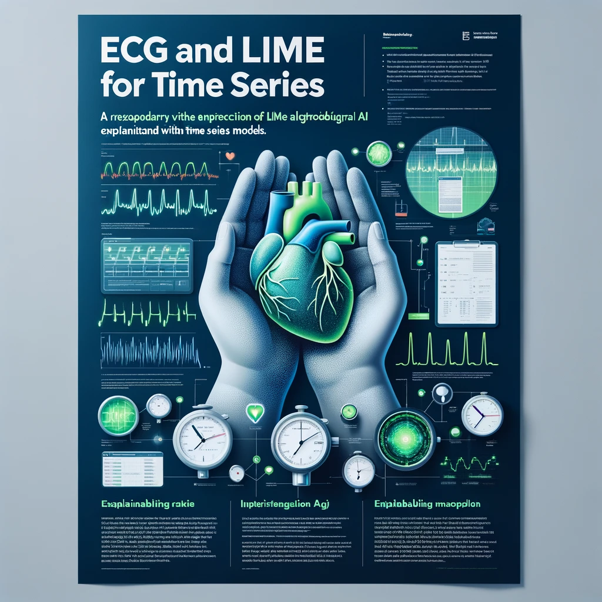

# LIME for Time-Series Explanation in ECG Classification

  

LIME for TimeSeries is an open-source project dedicated to advancing the interpretability of machine learning models focused on time series data. Utilizing the Local Interpretable Model-agnostic Explanations (LIME) technique, this project aims to demystify the decision-making processes of complex models. By integrating perturbation-based explanations, it provides insights into model predictions, enhancing transparency and trust in AI applications across various domains. Ideal for researchers, data scientists, and anyone invested in explainable AI (XAI), this repository offers tools, documentation, and examples to facilitate the understanding and application of LIME in time series analysis. By employing LIME, we aim to uncover which segments of an electrocardiogram (ECG) signal most influence the model's classification decisions, enhancing the interpretability of time-series models in healthcare.

## Overview

Time-series classification, particularly in the context of ECG signal analysis, plays a crucial role in diagnosing cardiovascular diseases. While deep learning models offer promising results, their "black-box" nature hinders clinical adoption due to the lack of interpretability. This project leverages LIME, a technique for explaining predictions of any classifier in an interpretable and faithful manner, by perturbing the input signal and observing the changes in predictions.

## Features
- **Data Preprocessing:** Techniques for transforming raw ECG signals into a format suitable for model training.
- **Model Training:** A Convolutional Neural Network (CNN) approach for ECG signal classification.
- **LIME Explanations:** Implementation of LIME to identify influential signal segments contributing to each classification decision.
- **Visualization Tools:** Utilities for visualizing ECG signals, their perturbations, and the influence of different segments on the model's predictions.

## Installation
Clone the repository to your local machine:
git clone https://github.com/yourusername/LIME-for-Time-Series.git
cd LIME-for-Time-Series
