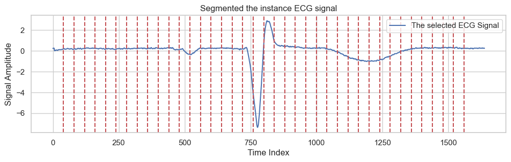
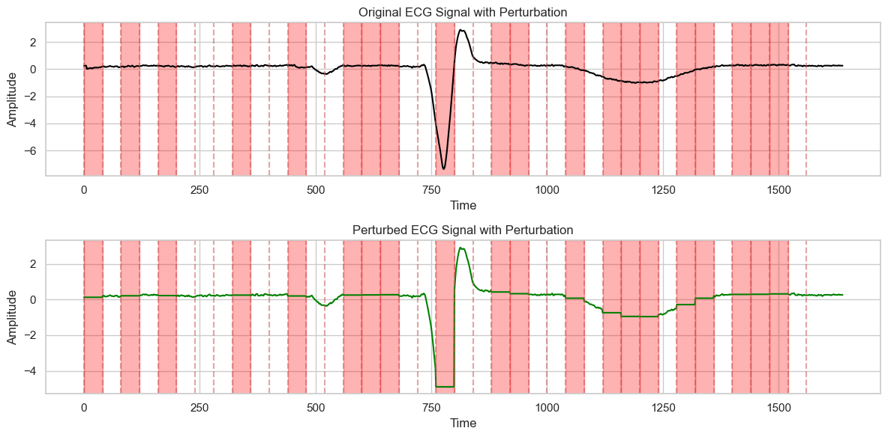
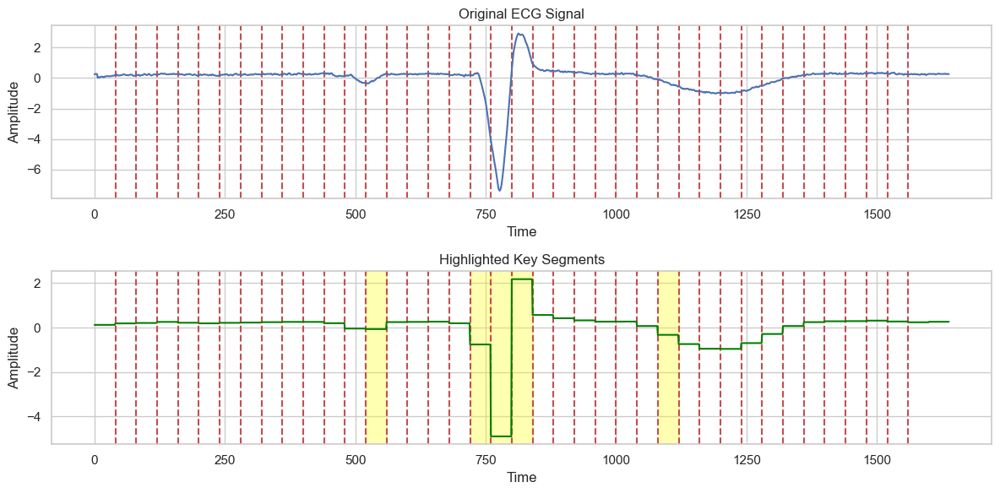

# LIME for Time-Series Explanation in ECG Classification

  

LIME for TimeSeries is an open-source project dedicated to advancing the interpretability of machine learning models focused on time series data. Utilizing the Local Interpretable Model-agnostic Explanations (LIME) technique, this project aims to demystify the decision-making processes of complex models. By integrating perturbation-based explanations, it provides insights into model predictions, enhancing transparency and trust in AI applications across various domains. Ideal for researchers, data scientists, and anyone invested in explainable AI (XAI), this repository offers tools, documentation, and examples to facilitate the understanding and application of LIME in time series analysis. By employing LIME, we aim to uncover which segments of an electrocardiogram (ECG) signal most influence the model's classification decisions, enhancing the interpretability of time-series models in healthcare.

## Overview

Time-series classification, particularly in the context of ECG signal analysis, plays a crucial role in diagnosing cardiovascular diseases. While deep learning models offer promising results, their "black-box" nature hinders clinical adoption due to the lack of interpretability. This project leverages LIME, a technique for explaining predictions of any classifier in an interpretable and faithful manner, by perturbing the input signal and observing the changes in predictions.

## Features
- **Data Preprocessing:** Techniques for transforming raw ECG signals into a format suitable for model training.
- **Model Training:** A Convolutional Neural Network (CNN) approach for ECG signal classification.
- **LIME Explanations:** Implementation of LIME to identify influential signal segments contributing to each classification decision.
- **Visualization Tools:** Utilities for visualizing ECG signals, their perturbations, and the influence of different segments on the model's predictions.

## Installation
Clone the repository to your local machine:

git clone https://github.com/mdhabibi/LIME-for-Time-Series.git

cd LIME-for-Time-Series

## Usage

- **Data Preparation:** Start by preparing the ECG dataset. The [`data_preprocess.py`](src/data_preprocess.py) module provides functions for loading and preprocessing the data.

- **Model Training:** Use the [`model_training.py`](src/model_training.py) module to train a CNN on the prepared ECG data. The module outlines the model architecture and training procedure.

- **Applying LIME:** The [`lime_explanation.py`](src/lime_explanation.py) module contains the implementation of LIME for time-series data. It includes functions for generating perturbations, applying perturbations to the signal, and fitting an interpretable model to the perturbed data.

- **Visualization:** The [`visualization.py`](src/visualization.py) module offers visualization utilities to plot the original and perturbed ECG signals, class distribution, and the impact of each segment on the model's predictions.

A detailed example of using these modules can be found in the [main.ipynb](notebooks/main.ipynb) within the notebooks directory.

## LIME Recipe for Time-Series Data: ECG Signal Classification

Explaining time-series predictions, especially in the medical domain, is crucial for trust and interpretability. Here, we detail the recipe for applying Local Interpretable Model-agnostic Explanations (LIME) to time-series data, focusing on ECG signals.

### Step 1: Data Preparation and Model Training

Before applying LIME, ensure you have a trained model ready. The model should be capable of classifying ECG signals into various categories (e.g., normal, arrhythmia types).

- Preprocess your ECG dataset, segmenting the signals and normalizing the data.
- Train a Convolutional Neural Network (CNN) model, or any suitable classifier, on the processed ECG data.

  

### Step 2: Generating Perturbations

Perturbations simulate small changes in the data to observe how the model's predictions vary. For ECG signals, perturbations can involve modifying segments of the signal to reflect potential variations in the heart's electrical activity.

- Divide each ECG signal into segments.
- Generate perturbed versions of a signal by modifying some segments while leaving others unchanged.

  

### Step 3: Applying LIME

With perturbations ready, LIME can be applied to explain individual predictions:

- For each perturbed signal, predict the class probabilities using the trained model.
- Calculate the similarity between each perturbed signal and the original signal. This typically involves measuring the cosine distance.
- Fit a simple interpretable model (e.g., linear regression) to the perturbations, using the similarity scores as weights. This model aims to approximate the complex model's behavior around the original signal.

### Step 4: Visualizing the Explanation

The coefficients of the interpretable model indicate the importance of each segment in influencing the model’s prediction:

- Identify the segments with the highest coefficients as the most influential for the model's prediction.
- Visualize the original signal, highlighting these influential segments to provide insight into which parts of the signal were most significant in reaching the classification decision.

  

## Contributing

Contributions to improve the project are welcome. Please follow the standard fork-pull request workflow on GitHub to submit your improvements.

## License

This project is licensed under the GNU General Public License v3.0 - see the [LICENSE](LICENSE) file for details or visit [GNU General Public License v3.0](https://www.gnu.org/licenses/gpl-3.0.en.html).

## Acknowledgments

This project is inspired by the original paper on LIME: ["Why Should I Trust You?" Explaining the Predictions of Any Classifier](https://arxiv.org/abs/1602.04938) by Marco Tulio Ribeiro, Sameer Singh, and Carlos Guestrin.
